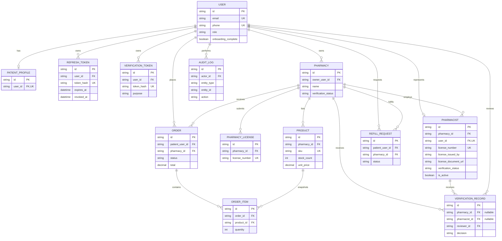

Vendor onboarding creates the `USER`, `PHARMACY`, `PHARMACY_LICENSE`, and supervising
`PHARMACIST` records together. The pharmacy and pharmacist credentials receive one
administrative decision, and the pharmacy is only exposed in the marketplace after
approval. Additional pharmacist staff linkage remains a separate internal workflow.

Medication, adherence, chat, and notification tables are intentionally deferred to
their implementation phases so migrations remain aligned with working application code.
